<div align="center">

# 🔐 Remote-Door V1.0 <br> Native Ethernet Edition

**Контролер дистанційного керування електромеханічним замком Atis Lock <br> на базі ESP32-C3 + W5500 з нативним стеком lwIP**

[](https://www.espressif.com/en/products/socs/esp32-c3)
[](https://www.wiznet.io/product-item/w5500/)
[](https://github.com/espressif/arduino-esp32)
[](https://core.telegram.org/bots)
[](LICENSE)

Автор: **[Stanislav Turii](https://github.com/Stanislav-developer)** · YouTube: **[@TehnoMaisterna](https://www.youtube.com/@TehnoMaisterna)**

</div>

---

## 🎬 Відеоогляд проєкту

<!-- TODO: Заміни VIDEO_LINK на посилання на відео, а PREVIEW_IMAGE на шлях до прев'ю (наприклад, Docs/youtube_preview.jpg) -->
<div align="center">
  <a href="https://youtu.be/d5a214GUi08?si=ROKAVji5T-b38r4e">
    
  </a>
  <p><i>▶️ Натисніть на зображення, щоб переглянути повний відеоогляд збірки та роботи пристрою</i></p>
</div>

---

## 📸 Готовий пристрій

<div align="center">
  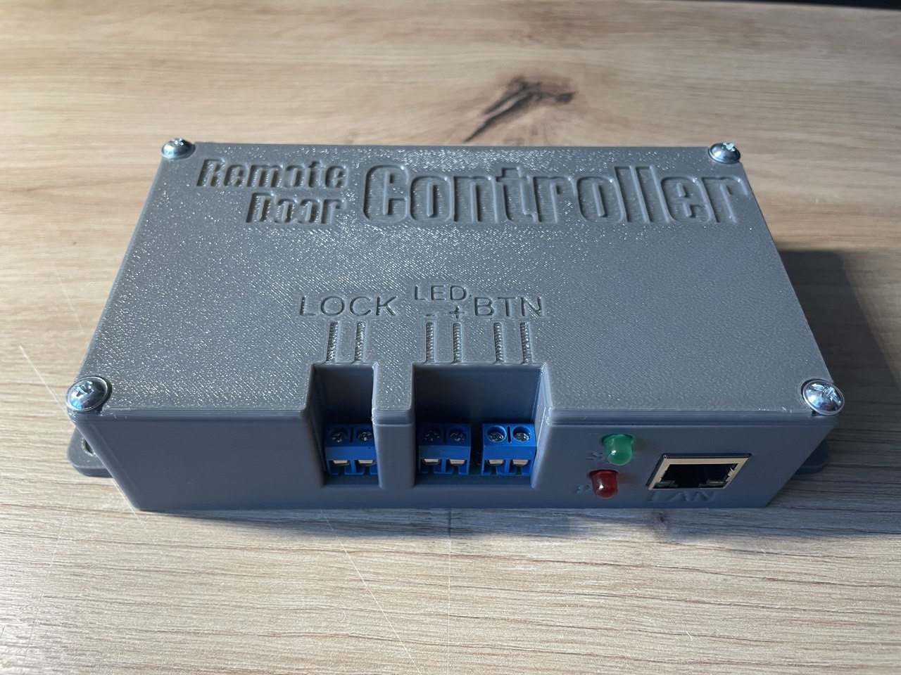
  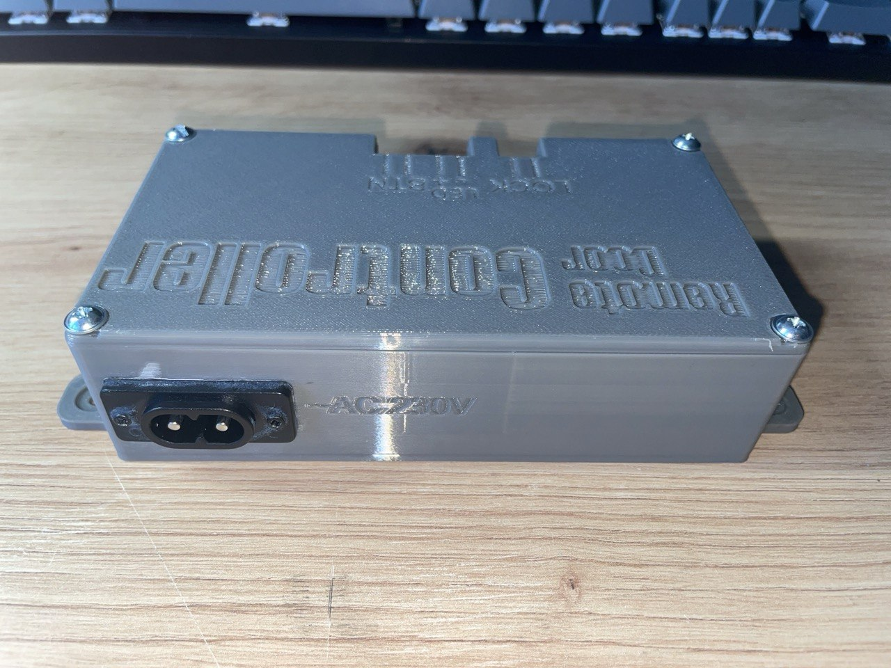
  <br><br>
  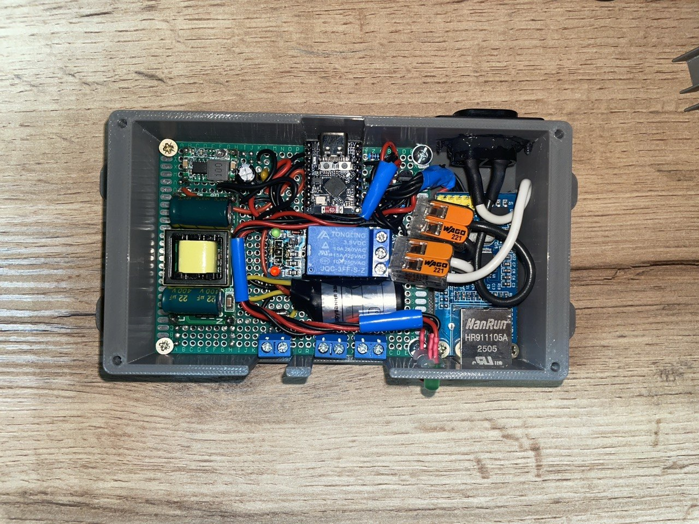
  <p><i>Корпус надруковано на 3D-принтері. Внутрішня компоновка: AC-DC блок живлення, ESP32-C3, W5500, релейний модуль</i></p>
</div>

---

## 📖 Про проєкт

**Remote-Door** — це автономний контролер для дистанційного або локального керування електромеханічним замком (наприклад, **Atis Lock**) в укриттях, сховищах та об'єктах автоматизації.

Керування здійснюється двома шляхами:

- 🌐 **Дистанційно** — через Telegram-бота з будь-якої точки світу
- 🔘 **Локально** — фізичною антивандальною кнопкою виходу на стіні

Пристрій підключається до мережі **дротовим Ethernet** — жодних проблем з нестабільним Wi-Fi у бетонних укриттях та підвалах.

---

## ⚙️ Архітектура: чому Native Ethernet (ETH.h)?

Ключова особливість проєкту — модуль **W5500 монтується безпосередньо у внутрішній мережевий стек lwIP** операційної системи ESP32 через вбудовану бібліотеку `ETH.h`, а не через сторонні бібліотеки типу `Ethernet.h` чи `EthernetLarge`.

| Критерій | 🟢 Native `ETH.h` (lwIP) | 🔴 Сторонні бібліотеки |
|---|---|---|
| **Швидкість** | Максимальна — драйвер працює на рівні ядра | Програмна емуляція стека, повільніше |
| **DHCP** | Plug & Play, IP отримується автоматично | Часто потрібне ручне налаштування підмереж |
| **TLS / HTTPS** | Апаратне шифрування **mbedtls** — рідний `WiFiClientSecure` працює "з коробки" | Потрібні милиці типу SSLClient |
| **Фаєрволи провайдера** | Стабільне «пробиття» локальних провайдерських фаєрволів | Часті проблеми з NAT/фільтрацією |
| **Сумісність з екосистемою** | Весь код (Telegram, NTP, WebServer) працює як зі звичайним Wi-Fi | Кожна бібліотека вимагає адаптації під свій клієнт |

```cpp
// Монтування W5500 прямо у стек lwIP — одним рядком:
ETH.begin(ETH_PHY_W5500, 1, W5500_CS, -1, W5500_RST, SPI);
```

---

## ✨ Можливості (Features)

- 🤖 **Керування через Telegram** — відкриття замка, дозвіл/заборона кнопки, статус, скидання
- 🔘 **Фізична кнопка виходу** — антивандальна кнопка на стіні з керованою підсвіткою
- ⏳ **Захисний таймаут (Cooldown) 5 секунд** після кожного відкриття:
  - блокує заспамлювання командами з мережі
  - захищає котушку замка від перегріву
  - усуває брязкіт контактів кнопки
  - супроводжується асинхронним миготінням підсвітки кнопки
- 🌐 **Captive Portal конфігурації** — автономна точка доступу з веб-інтерфейсом для налаштування (пароль AP, Bot Token, Chat ID, Group ID). Запускається автоматично при чистій флеш-пам'яті або вручну кнопкою BOOT
- 🔑 **Дворівневе підтвердження безпеки** — команда `/clear_data` вимагає введення системного пароля перед очищенням пам'яті NVS
- 💡 **Асинхронна LED-індикація статусу (SYS LED)**:
  - ⚡ часте блимання — пошук DHCP / очікування мережі
  - 🌊 плавне ШІМ-«дихання» — режим веб-налаштування
  - 🔆 постійне світіння — стабільний зв'язок
- 📊 **Статистика** — лічильник відкривань та аптайм зберігаються у NVS
- 🕐 **Синхронізація часу** через NTP (`pool.ntp.org`, `time.google.com`)

---

## 📦 Специфікація компонентів (BOM)

### Основні модулі

| Фото | Компонент | Опис |
|:---:|---|---|
| 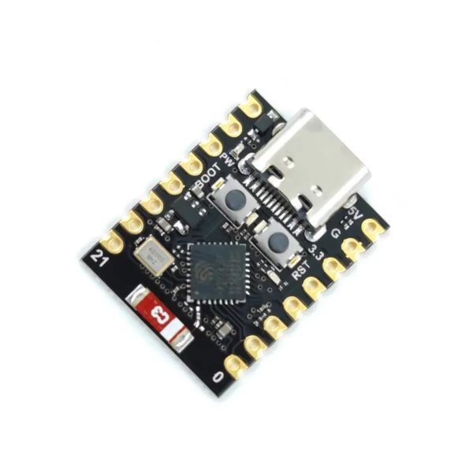 | **ESP32-C3 Super Mini** | Головний мікроконтролер (RISC-V, USB-C) |
| 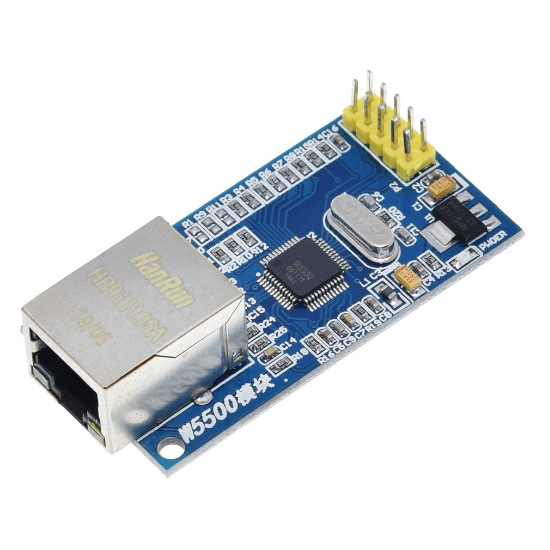 | **W5500 Ethernet Module** | Апаратний TCP/IP контролер, SPI |
| 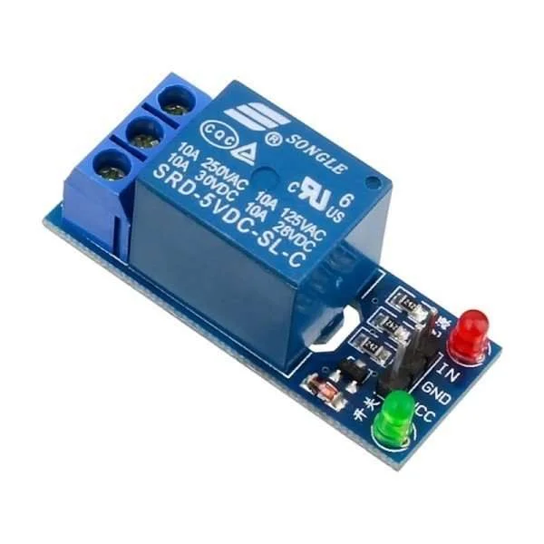 | **Релейний модуль 5V** | Комутація живлення котушки замка (Active LOW) |
| 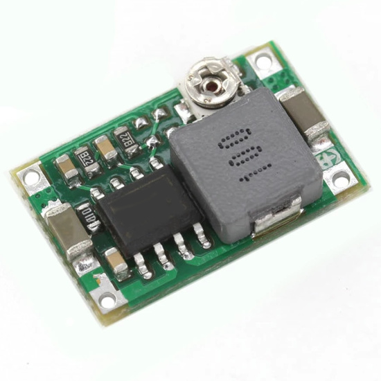 | **Mini360 (MP2307)** | DC-DC понижуючий конвертер 12V → 5V |
| 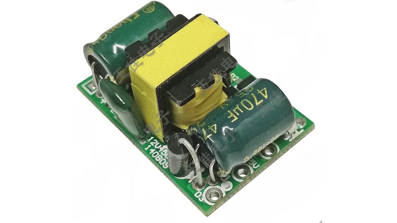 | **AC-DC конвертер 220V → 12V, 1A** | Основне джерело живлення пристрою |
| 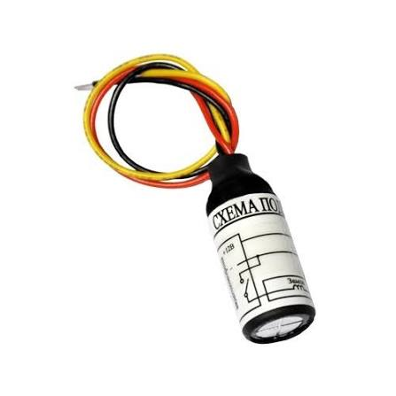 | **БКЗ / БУЗ (Блок керування замком)** | Захист котушки замка та фільтрація завад |

### Дискретні компоненти та монтаж

| К-сть | Компонент | Призначення |
|:---:|---|---|
| 1 | Макетна плата **7×9 см** | Несуча плата для монтажу всіх модулів |
| 1 | Електролітичний конденсатор **47 мкФ** | Згладжування просідань живлення |
| 1 | Керамічний конденсатор **100 нФ (0.1 мкФ)** | Фільтрація ВЧ-завад по лінії 5V/GND |
| 2 | Світлодіоди **5 мм** | Індикація системного статусу (sys) та живлення (pwr) |
| 2 | Резистори **330 Ом** | Струмообмеження світлодіодів |
| 1 | Резистор **1.1 кОм** | База транзистора підсвітки кнопки |
| 1 | Резистор **10 кОм** | Підтяжка |
| 1 | Транзистор **BC547 (NPN)** | Ключ підсвітки кнопки виходу |
| 3 | Клеми **DG301-5.0-02P-12-02A** | Підключення замка (LOCK), підсвітки (LED), кнопки (BTN) |
| 1 | Гніздо **AC-006A** | Вхід мережевого живлення 220V |

---

## 🔌 Схема підключення

<div align="center">
  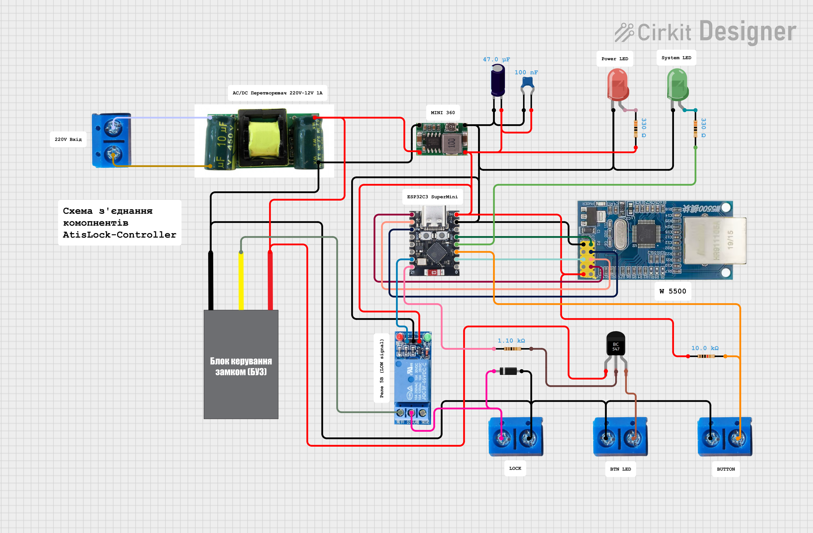
  <p><i>Повна схема з'єднань пристрою</i></p>
</div>

### Таблиця розпиновки (Pinout)

**ESP32-C3 ↔ W5500 (SPI):**

| Сигнал W5500 | GPIO ESP32-C3 |
|---|:---:|
| SCK | **4** |
| MISO | **5** |
| MOSI | **6** |
| CS | **7** |
| RST | **1** |

**Периферія:**

| Пристрій | GPIO | Режим |
|---|:---:|---|
| Реле замка | **20** | Active LOW, Z-стан у спокої |
| Транзистор підсвітки кнопки | **21** | Active HIGH |
| Кнопка виходу | **2** | `INPUT_PULLUP`, замикання на GND |
| Системний світлодіод (SYS LED) | **3** | ШІМ (LEDC, 1 кГц) |
| Кнопка BOOT (вхід у режим Setup) | **9** | `INPUT_PULLUP` |

### Транзисторний ключ підсвітки кнопки

Підсвітка реалізована за схемою **Active HIGH** через NPN-транзистор **BC547**:

```
GPIO21 ──[ R 1–1.5 кОм ]──► База BC547
                            Колектор ──► Катод LED кнопки (анод → +живлення)
                            Емітер   ──► GND
```

> [!WARNING]
> **Захист від завад — обов'язковий!** Пристрій працює поруч із силовим обладнанням. Для захисту від високочастотних завад електроінструменту (перфоратори, дрилі) та згладжування мікропросідань логіки живлення **обов'язково** встановіть:
> - **БКЗ (Блок Керування Замком)** у розрив лінії котушки замка
> - Керамічний конденсатор **0.1 мкФ** паралельно лініям живлення 5V/GND плат
> - Захисний діод **1N4007** на котушці замка (зворотним ввімкненням)
>
> Без цих елементів можливі хибні перезавантаження ESP32 у момент роботи замка.

> [!NOTE]
> Реле керується нестандартно, але безпечно: у стані спокою GPIO20 переведено у **високоімпедансний Z-стан** (`INPUT`), а для спрацювання пін короткочасно стає виходом із низьким рівнем. Це виключає випадкове відкриття замка при старті/перезавантаженні контролера.

---

## 🖨️ 3D-модель корпуса

Корпус розроблено у **Fusion 360** та надруковано на 3D-принтері. Кришка має гравіювання назви пристрою та маркування всіх клем (LOCK / LED / BTN), а бічні панелі — вирізи під RJ45, індикатори та гніздо живлення 230V.

<div align="center">
  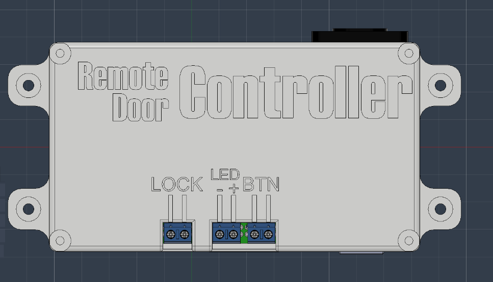
  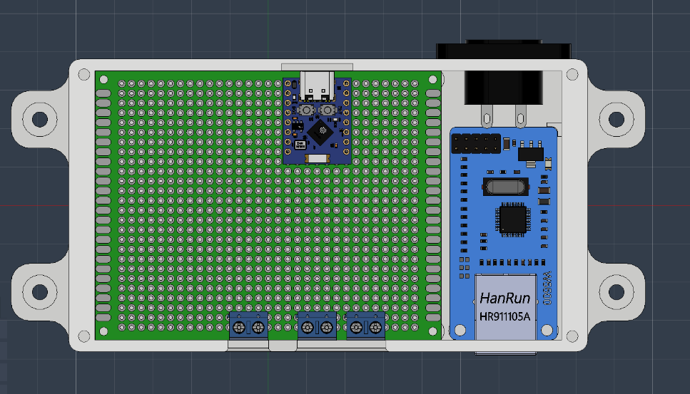
  <br><br>
  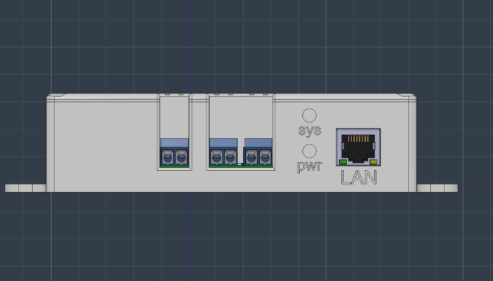
  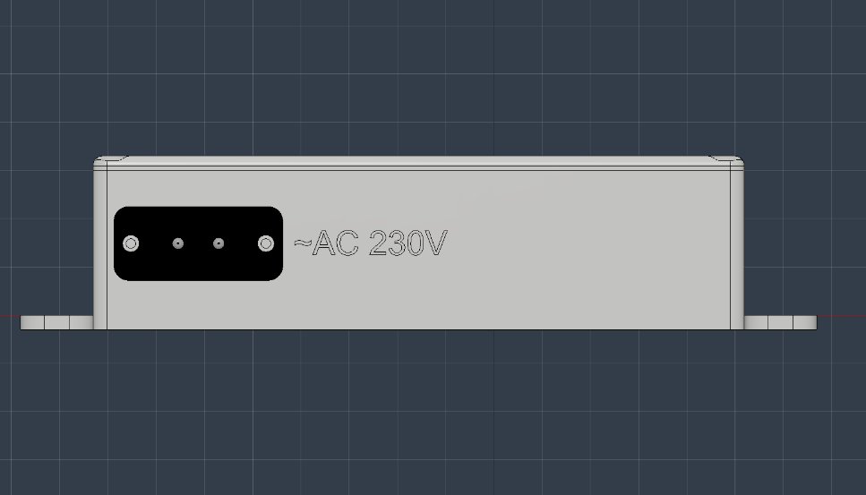
</div>

### 📥 Завантажити файли для друку

| Файл | Опис |
|---|---|
| [**Top.stl**](3D%20Models/Top.stl) | Верхня кришка з гравіюванням та отворами під клеми |
| [**Bottom.stl**](3D%20Models/Bottom.stl) | Основа корпуса з монтажними вушками |

> [!TIP]
> Рекомендовані налаштування друку: PETG або ABS (пристрій може працювати у неопалюваних приміщеннях), заповнення 15–20%, шар 0.2 мм.

---

## 🚀 Перший запуск та конфігурація

### Крок 1 — Прошивка

Налаштування **Arduino IDE** (меню *Tools*):

| Параметр | Значення |
|---|---|
| Board | `ESP32C3 Dev Module` |
| **USB CDC On Boot** | `Enabled` ⚠️ *(обов'язково для Serial Monitor)* |
| **Partition Scheme** | `Huge APP (3MB No OTA/1MB SPIFFS)` |
| Решта налаштувань | за замовчуванням |

Необхідна бібліотека: [`UniversalTelegramBot`](https://github.com/witnessmenow/Universal-Arduino-Telegram-Bot) (встановлюється через Library Manager).

**Вхід у режим прошивки (bootloader):**
1. Під'єднайте ESP32-C3 до комп'ютера через USB-C
2. Затисніть кнопку **BOOT**
3. Утримуючи BOOT, натисніть **RESET** (~1 сек)
4. Відпустіть RESET, потім відпустіть BOOT

### Крок 2 — Створення Telegram-бота

1. Напишіть [@BotFather](https://t.me/BotFather) → `/newbot` → отримайте **Bot Token**
2. Дізнайтеся свій **Chat ID** (наприклад, через [@userinfobot](https://t.me/userinfobot))
3. *(Опційно)* Додайте бота у групу та отримайте її **Group ID**

### Крок 3 — Налаштування через Web-інтерфейс

1. При **першому запуску** (чиста флеш-пам'ять) пристрій автоматично створює точку доступу **`Remote-Door-Setup`**. Системний світлодіод плавно «дихає» 🌊
2. Підключіться до цієї Wi-Fi мережі з телефона — Captive Portal відкриє сторінку налаштувань автоматично (або перейдіть на `192.168.4.1`)
3. Заповніть поля:
   - **Системний пароль** (мін. 8 символів) — захищає точку доступу та команду скидання
   - **Telegram Bot Token**
   - **Chat ID власника**
   - **Group ID** *(необов'язково)*
4. Натисніть **ЗБЕРЕГТИ** — пристрій перезавантажиться та підключиться до мережі

> [!TIP]
> Щоб **повторно увійти в режим налаштування** на вже сконфігурованому пристрої — затисніть кнопку **BOOT (GPIO9)** та увімкніть живлення (або натисніть RESET, утримуючи BOOT).

### Крок 4 — Підключення Ethernet

Вставте кабель у роз'єм RJ45 (LAN). Пристрій отримає IP через **DHCP** автоматично — жодних ручних налаштувань. Після успішного підключення:
- системний LED (sys) світиться **постійно** 🔆
- у Telegram надходить повідомлення *«Контролер Remote-Door активний!»*

---

## 🤖 Команди Telegram-бота

| Команда | Дія |
|---|---|
| `/unlock` | 🔓 Відчинити двері *(прихована з публічного меню)* |
| `/allow` | ✅ Дозволити відкриття з фізичної кнопки |
| `/deny` | 🚫 Заборонити відкриття з фізичної кнопки |
| `/status` | 📊 Статус системи, лічильник відкривань, аптайм |
| `/clear_data` | ⚠️ Повне скидання конфігурації *(вимагає пароль)* |
| `/help`, `/start` | 👋 Довідка |

### Список для швидкої вставки у BotFather (`/setcommands`)

```
allow - Дозволити відкриття дверей з фізичної кнопки
deny - Заборонити відкриття дверей з фізичної кнопки
status - Отримати статус системи та час аптайму
clear_data - Повне скидання конфігурації та статистики
```

> [!NOTE]
> Команда `/unlock` **свідомо не додається** у публічне меню бота — вона працює, але не світиться у списку команд. Це додатковий рівень захисту від випадкового натискання.

---

## 📁 Структура репозиторію

```
ESP32-Remote-AtisLock-Controller/
├── 3D Models/
│   ├── Top.stl                  # Верхня кришка корпуса
│   └── Bottom.stl               # Основа корпуса
├── Docs/                        # Фото, схема, рендери для README
├── Remote_Door_V1.0/
│   └── Remote_Door_V1.0.ino    # Прошивка
├── LICENSE                      # MIT
└── README.md
```

---

## 📜 Ліцензія

Проєкт розповсюджується за ліцензією **[MIT](LICENSE)** — використовуйте, модифікуйте та діліться вільно.

---

<div align="center">

**Developed with ❤️ by [Stanislav Turii](https://github.com/Stanislav-developer)**

🎥 [YouTube — TehnoMaisterna](https://www.youtube.com/@TehnoMaisterna) · 💻 [GitHub](https://github.com/Stanislav-developer)

⭐ *Якщо проєкт був корисним — поставте зірку репозиторію!*

</div>
